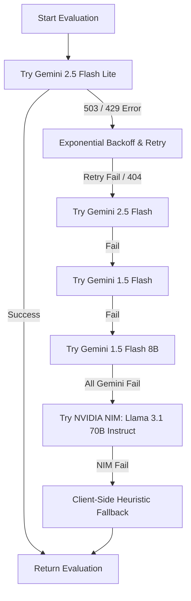

# Reicrew AI Platform: Comprehensive Evaluation Logic & Heuristics Report (Version 2)

This report documents the end-to-end evaluation logic, mathematical formulas, system prompts, parameter configurations, adaptive heuristics, and proctoring algorithms running in the system.

Reference Files:
- [aiService.ts](file:///c:/Users/PRANITA/types/services/aiService.ts) (Orchestrates overall report aggregation, contradictions, stability, and follow-ups)
- [apiService.ts](file:///c:/Users/PRANITA/types/services/apiService.ts) (Handles single response evaluation prompts, local fallback heuristics, and difficulty signals)
- [DynamicInterviewScreen.tsx](file:///c:/Users/PRANITA/types/components/DynamicInterviewScreen.tsx) (Orchestrates proctoring violations, adaptive question routing, and session lifecycle)
- [types.ts](file:///c:/Users/PRANITA/types/types.ts) (Specifies exact evaluation interfaces and metadata versions)

---

## 1. Single Answer Evaluation

When a candidate answers a question, the platform transcribes their audio using speech-to-text and forwards the transcript to the AI evaluation engine.

### A. Evaluator Persona and Prompt (Prompt C)
The platform instructs the LLM (primarily `gemini-2.5-flash-lite`) to operate as a strict technical evaluator.

**System Prompt Template:**
```text
You are an advanced AI Interview Evaluator designed to perform STRICT, EVIDENCE-BASED candidate evaluation.

CORE RULES (MANDATORY):
1. NO ASSUMPTIONS: Do NOT assume skills, knowledge, or intent. If not explicitly shown -> treat as weak/missing.
2. NO GENERIC PRAISE: Every judgment must be backed by a specific reason/evidence.
3. DEPTH OVER SURFACE: Penalize shallow/memorized answers. Reward structured thinking.
4. REALISTIC EVALUATION: Only evaluate what can be inferred from text.

[ROLE CONTEXT]
Position: {position}
Interview Difficulty: {difficulty}

[EVALUATION RUBRIC]
{difficultyRubric}

[INTERVIEW PROGRESS]
Question: "{question}"
Reference/Ideal Key Points: {keyPoints}
Candidate's Answer: "{answer}"

[VISUAL DATA]
Vision Analysis Summary: {visualMetrics.currentExpression}
Confidence: {visualMetrics.confidenceLevel}%

Return strictly the following JSON structure:
{
  "accuracy": number, // 0-10
  "conceptCoverage": number, // 0-10
  "conceptUnderstanding": number, // 0-10
  "reasoning": number, // 0-10
  "depth": number, // 0-10
  "clarity": number, // 0-10
  "structure": number, // 0-10
  "confidence": number, // 0-10
  "consistency": number, // 0-10
  "answerDirectnessScore": number, // 0-10
  "tradeoffReasoningScore": number | null, // 0-10 or null
  "technicalErrors": [
    { "error": "description of incorrect or hallucinated statement", "severity": "low" | "medium" | "high" }
  ],
  "matchedKeyPoints": ["concepts the candidate covered"],
  "missingKeyPoints": ["concepts the candidate missed"],
  "feedback": "2-sentence specific feedback. State what was good and what was missing. NO generic praise."
}
```

### B. Difficulty-Based Scoring Rubrics
The model adjusts its scoring leniency according to the configured difficulty mode:
- **Easy / Very Easy (Lenient):** Focuses on basic conceptual understanding. Stuttering or basic delivery is ignored. (Passing score: 5/10).
- **Medium (Balanced):** Balanced evaluation of both conceptual clarity and delivery. (Passing score: 7/10).
- **Hard / Very Hard (Strict):** Highly critical. Penalizes filler words, repetitive phrasing, and vagueness. Expects precision and complete keyword coverage. (Passing score: 8/10).

### C. The Keyword Listing Penalty (Anti-Cheating / Anti-Bluffing)
If a candidate attempts to "keyword stuff" or list terms without explanation (e.g., reciting *"encapsulation, inheritance, polymorphism, abstraction"* for OOP without explaining what they mean), the system triggers a strict penalty override:
- `conceptUnderstanding` is capped at **$\le 2.0 / 10$**.
- `depth` is capped at **$\le 1.0 / 10$**.
- `reasoning` is capped at **$\le 2.0 / 10$**.
- `accuracy` and `conceptCoverage` are capped at **$\le 4.0 / 10$**.
- The AI explicitly reports the keyword listing behavior in its textual feedback.

### D. Mathematical Formulas for Question Scores
Once the raw LLM parameters are returned, the system applies the following mathematical rules:

#### 1. Technical Error Deductions
Any hallucinated, incorrect, or contradictory statements flagged by the AI trigger deductions from the content score:
- Low-severity error: **$-0.25$** points.
- Medium-severity error: **$-0.75$** points.
- High-severity error: **$-1.50$** points.
- **Maximum deduction cap:** **$2.0$** points.

$$\text{Error Deduction} = \min\left(2.0, \sum (0.25 \cdot N_{\text{low}} + 0.75 \cdot N_{\text{med}} + 1.50 \cdot N_{\text{high}})\right)$$

#### 2. Content Score Formula
Combines accuracy, understanding, reasoning, depth, and concept coverage weights, then subtracts the error deduction:

$$\text{Content Score} = \text{Round}\Big(\text{Clamp}\big(0, 10, (0.30 \cdot \text{Accuracy} + 0.25 \cdot \text{Understanding} + 0.20 \cdot \text{Reasoning} + 0.15 \cdot \text{Depth} + 0.10 \cdot \text{Coverage}) - \text{Error Deduction}\big) \cdot 10\Big) / 10$$

#### 3. Communication Score Formula
Evaluates delivery clarity, structure, confidence, and consistency:

$$\text{Communication Score} = \text{Round}\left(\frac{\text{Clarity} + \text{Structure} + \text{Confidence} + \text{Consistency}}{4} \cdot 10\right) / 10$$

#### 4. Verdict Assignment
Based on the final Content Score:
- **Excellent:** $\ge 8.0$
- **Good:** $\ge 6.0$
- **Borderline:** $\ge 4.0$
- **Fail:** $< 4.0$

#### 5. Evaluation Confidence Score
Evaluates the internal alignment of the evaluation parameters:

$$\text{Evaluation Confidence} = \text{Round}\big((0.30 \cdot \text{Coverage} + 0.30 \cdot \text{Understanding} + 0.20 \cdot \text{Reasoning} + 0.20 \cdot \text{Consistency}) \cdot 10\big)$$

---

## 2. Local Fallback Heuristics (Offline / Server Error)

If the primary LLM and backup model APIs are completely unreachable, the system automatically runs `localEvaluate` on the client's device to score the answer.

### A. Local Scoring Formulas
$$\text{Local Score} = 0.6 \cdot \text{Keyword Match Score} + 0.2 \cdot \text{Length Score} + 0.2 \cdot \text{Concept Density Score}$$

#### 1. Keyword Match Score
Matches words in the user's transcript against expected `keyConcepts`. Concepts are weighted:
- High-importance concept: **$2.0$**
- Medium-importance concept: **$1.0$**
- Low-importance concept: **$0.5$**

A concept is marked as "matched" if $\ge 40\%$ of its non-trivial words (length $>3$ characters) are found in the candidate's transcript.

$$\text{Keyword Match Score} = \frac{\sum \text{Weights of Matched Concepts}}{\sum \text{Weights of All Concepts}} \cdot 10$$

#### 2. Length Score
Measures response completeness based on word count:
- $< 10$ words: **$1$**
- $10 \le \text{words} < 20$: **$3$**
- $20 \le \text{words} < 40$: **$5$**
- $40 \le \text{words} < 80$: **$7$**
- $80 \le \text{words} < 150$: **$8$**
- $\ge 150$ words: **$9$**

#### 3. Concept Density Score
Measures the concentration of unique, concept-relevant words compared to total words spoken (up to a window size of 50 words):

$$\text{Density Ratio} = \frac{\text{Unique concept words matched}}{\min(\text{Total transcript word count}, 50)}$$
$$\text{Concept Density Score} = \min(10, \text{Density Ratio} \cdot 30)$$

### B. Fallback Evaluation Confidence
Local evaluations are flagged as low-confidence:

$$\text{Local Evaluation Confidence} = \min\left(70, \frac{\text{Matched Concepts}}{\text{All Concepts}} \cdot 40 + \min\left(20, \frac{\text{Word Count}}{4}\right) + 10\right)$$

---

## 3. Adaptive Interview Routing & Flow

Rather than a static list of questions, the interview behaves like an adaptive state machine.

### A. Adaptive Difficulty Routing
The system adjusts subsequent question difficulty dynamically. The driver is the `localDifficultySignal` metric:

$$\text{Difficulty Signal} = 0.7 \cdot \text{Keyword Coverage} + 0.3 \cdot \text{Completeness}$$

- **After Question 1:**
  - If $\text{Q1 Signal} \ge 7.5$: Next question is **Hard**.
  - If $5.0 \le \text{Q1 Signal} < 7.5$: Next question is **Medium**.
  - If $\text{Q1 Signal} < 5.0$: Next question is **Easy**.
- **After Question 2:**
  - Evaluates both Q1 and Q2 signals, prioritizing the recent answer:
    $$\text{Average Signal} = 0.7 \cdot \text{Q2 Signal} + 0.3 \cdot \text{Q1 Signal}$$
  - If $\text{Average Signal} \ge 7.5$: Next question is **Hard**.
  - If $5.0 \le \text{Average Signal} < 7.5$: Next question is **Medium**.
  - If $\text{Average Signal} < 5.0$: Next question is **Easy**.
- **Questions 4 & 5:** Always behavioral questions (Behavioral Experience & Behavioral Situation) to evaluate soft skills.

### B. Dynamic Follow-Up Questions (Bluff/Depth Detection)
If the candidate answers a primary technical question and scores high, but the system suspects keyword reciting or a lack of logical depth, it triggers a dynamic follow-up question in real time.

#### 1. Trigger Conditions
A follow-up question is generated if `contentScore > 8.0` and *either*:
1. **Depth/Reasoning Discrepancy:** The candidate has strong conceptual metrics but lacks depth/reasoning logic:
   $$\text{Reasoning} < \text{Understanding} \quad \text{OR} \quad (\text{Coverage} - \text{Understanding}) > 2.0$$
2. **Deterministic Random Sampling:** To audit high scores, there is a $20\%$ chance for any session where `contentScore > 8.0`:
   $$(\text{Hash}(\text{Session ID} + \text{Question ID}) \bmod 100) < 20$$

#### 2. Follow-Up Evaluation & Reliability Score
When a candidate answers a follow-up, it is evaluated against the same rubrics. A comparison is made against the parent question score to measure candidate credibility:

$$\text{Score Collapse} = \max(0, \text{Parent Content Score} - \text{Follow-Up Content Score})$$
$$\text{Reliability Score} = \max(0, \min(100, 100 - (\text{Score Collapse} \cdot 15)))$$

> [!NOTE]
> A significant drop in the score on a follow-up question (e.g., scoring a 9.0 on the primary and a 4.0 on the follow-up) indicates the candidate may have memorized definitions without actual technical depth, resulting in a low **Reliability Score**.

---

## 4. Proctoring & Session Integrity (WebGL/MediaPipe Engine)

The local engine continuously runs in the background to detect cheating. It generates an **Integrity Score** independently from technical scores.

### A. Violation Weights
Violations add points directly to a session's `violationScore`:
- **Tab Hidden / Focus Loss (`TAB_HIDDEN`):** $+2$ points.
- **Copy / Paste action (`COPY_PASTE`):** $+2$ points.
- **Fullscreen Exit (`FULLSCREEN_EXIT`):** $+3$ points.
- **No Face Detected for 15s (`NO_FACE`):** $+3$ points.
- **Multiple Faces Detected for 3s (`MULTIPLE_FACES`):** $+5$ points.
- **Camera / Mic Disconnected:** Logged on timeline; increases risk markers.
- **Gaze Away (`GAZE_AWAY_LOG_ONLY`):** Tracked and accumulated in telemetry (`totalGazeAwayDurationMs`), but does **not** deduct integrity points (Log-only to avoid false-positives for deep thinkers).

### B. Integrity Score Calculation
Calculated from the accumulated `violationScore` at the end of the session:

$$\text{Integrity Score} = \max(0, 100 - (\text{Violation Score} \cdot 10))$$

### C. Violation Action Thresholds
- **Violation Score $\ge 5$:** Warning toast notification shown in the UI.
- **Violation Score $\ge 10$:** Severe warning toast notification in red text.
- **Violation Score $\ge 15$:** **Immediate Interview Termination**. The camera stream is cut off, and the system aggregates the current session answers and locks the candidate out.

---

## 5. Session Score Aggregation (The Master Report)

At interview completion, the platform aggregates all data to synthesize the recruiter's report.

### A. Individual Performance Metrics
- **Knowledge Score:** Matches the aggregated `technicalScore`.
- **Reasoning Score:** Average of question reasoning scores scaled to 100:
  $$\text{Reasoning Score} = \text{Round}\left(\frac{\sum \text{Reasoning Score of answers}}{\text{Answer Count}} \cdot 10\right)$$
- **Communication Score:** Average of question communication scores:
  $$\text{Communication Score} = \text{Round}\left(\frac{\sum \text{Communication Score of answers}}{\text{Answer Count}} \cdot 10\right)$$
- **Consistency Score:** Heavily penalized by contradictions:
  $$\text{Consistency Score} = \max(0, 100 - \text{Contradiction Penalty} \cdot 12.5)$$

### B. Performance Trend
Calculated over the chronological timeline of technical responses (minimum 3 answers):
- **Improving:** $\text{Second Half Average Score} - \text{First Half Average Score} \ge 1.0$ (on a 10-point scale).
- **Declining:** $\text{First Half Average Score} - \text{Second Half Average Score} \ge 1.0$.
- **Stable:** Otherwise.

### C. Difficulty & Discrimination Weights
Different questions carry different weights in the final scoring based on their difficulty level and category type:

#### 1. Difficulty Weight ($W_{\text{diff}}$)
- **Easy:** $1.0$
- **Medium:** $2.0$
- **Hard:** $3.0$

#### 2. Discrimination Weight ($W_{\text{disc}}$)
Measures the question's ability to distinguish expert candidates:
- **Hard Technical:** $1.5$
- **Scenario / Practical:** $1.2$
- **Fundamentals:** $0.8$
- **Default / Other:** $1.0$

#### 3. Difficulty-Weighted Performance
The weighted average of candidate responses (scaled to 100):

$$\text{Weighted Performance} = \text{Round}\left(\frac{\sum (\text{Content Score}_i \cdot W_{\text{diff}, i} \cdot W_{\text{disc}, i})}{\sum (W_{\text{diff}, i} \cdot W_{\text{disc}, i})} \cdot 10\right)$$

### D. Technical Contradiction Check
The system runs all technical transcripts through a contradiction model to verify that the candidate did not make opposing technical statements across different questions.

**Contradiction System Prompt:**
```text
You are evaluating a candidate's technical responses in an interview for contradictions.
Only look for actual direct technical contradictions between answers, ignoring subjective, behavioral, or personal statements.
For example, if in one answer they say "Java is pass-by-reference" and in another they say "Java is pass-by-value", that is a high-severity confirmed contradiction.
Do not flag minor phrasing variations as contradictions.

TRANSCRIPTS TO EVALUATE:
{transcripts}

Return strictly the following JSON structure:
{
  "crossQuestionContradictions": [
    {
      "qIndex1": number,
      "qIndex2": number,
      "explanation": "detailed explanation of why these two answers contradict",
      "severity": "low" | "medium" | "high",
      "status": "confirmed" | "possible" | "insufficient_evidence",
      "confidence": number // confidence score from 0 to 100
    }
  ]
}
```

#### Contradiction Penalties
Confirmed contradictions with confidence $\ge 70\%$ deduct points from the technical score:
- Low-severity contradiction: **$-1$** point.
- Medium-severity contradiction: **$-2$** points.
- High-severity contradiction: **$-4$** points.
- **Maximum contradiction penalty cap:** **$8$** points.

$$\text{Contradiction Penalty} = \min\left(8, \sum (1 \cdot C_{\text{low}} + 2 \cdot C_{\text{med}} + 4 \cdot C_{\text{high}})\right)$$

### E. Final Technical Score
Subtracts the contradiction penalty from the difficulty-weighted performance:

$$\text{Technical Score} = \max(0, \min(100, \text{Weighted Performance} - \text{Contradiction Penalty}))$$

### F. Trust Score (Trust-Adjusted Final Score)
The overall final score represents the Technical Score adjusted by the candidate's Proctoring Integrity:

$$\text{Trust Score} = \text{Round}\left(\text{Technical Score} \cdot \frac{\text{Integrity Score}}{100}\right)$$

---

## 6. Recruiter Decisions & Status Overrides

The hiring recommendation and data confidence thresholds govern final reports.

### A. Recommendation Matrix
The recommendation adapts to candidate trust and performance:
- **Reject:**
  - $\text{Integrity Score} < 40$ OR $\text{Trust Score} < 50$
- **Consider:**
  - $40 \le \text{Integrity Score} < 55$ OR $50 \le \text{Trust Score} < 70$
- **Hire:**
  - $70 \le \text{Trust Score} < 85$ (given $\text{Integrity Score} \ge 55$)
- **Strong Hire:**
  - $\text{Trust Score} \ge 85$ (given $\text{Integrity Score} \ge 55$)

### B. Insufficient Evidence Override
If the average evaluation confidence of the session is low and the topic coverage is shallow, the system flags the recommendation status as `insufficient_evidence` to alert human reviewers:

$$\text{Status Override} = \text{insufficient\_evidence} \quad \text{if} \quad \text{Average Confidence} < 55 \quad \text{AND} \quad \text{Topic Coverage} < 50\%$$

---

## 7. Model Priority & Resilience Chain

To prevent interview failures due to API rate limits or regional outages, the system utilizes a resilient model priority chain.



1. **Model Chain Priority:**
   `gemini-2.5-flash-lite` $\rightarrow$ `gemini-2.5-flash` $\rightarrow$ `gemini-1.5-flash` $\rightarrow$ `gemini-1.5-flash-8b`.
2. **NVIDIA NIM Fallback:**
   If all Google endpoints fail, the request is routed to NVIDIA's NIM API targeting `meta/llama-3.1-70b-instruct`.
3. **Local Fallback Heuristics:**
   If all remote servers are offline, the client browser calculates the metrics using the `localEvaluate` keyword-matching engine.
