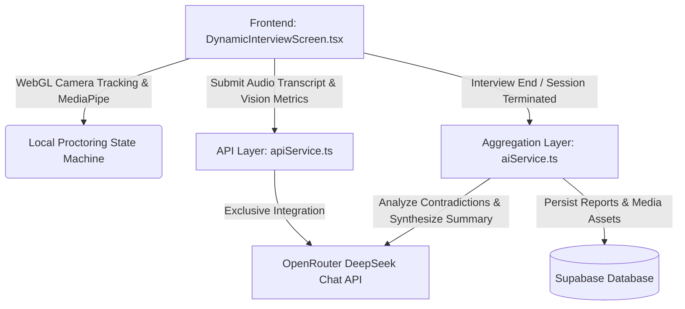

# Reicrew AI Platform: Active Evaluation & Scoring Logic Report (Version 3)

This document provides a detailed report of the evaluation logic, system parameters, architectural flow, and prompts that are **currently implemented and actively running** in the system.

---

## 1. System Architecture & Model Selection

The system has transitioned from Gemini models to a single-model exclusive API structure.



* **Core AI Engine:** All dynamic question generation, answer evaluation, follow-up logic, contradiction checks, and report synthesis use **`deepseek/deepseek-chat` via the OpenRouter API**.
* **Authentication Key:** Managed via the environment variable `VITE_OPENROUTER_API_KEY`.
* **Database Integration:** Scores, final aggregated reports, and uploaded proctoring snapshots/video clips are saved to **Supabase** via the [SupabaseService](file:///c:/Users/PRANITA/types/services/supabaseService.ts).

---

## 2. Individual Question Evaluation

For every answered question, the transcribed text and ideal answer guide are sent to [apiService.ts](file:///c:/Users/PRANITA/types/services/apiService.ts) for evaluation.

### A. Evaluator Rubrics & Prompt
The prompt guides the model to act as an objective technical recruiter.

**Prompt Template:**
```text
You are evaluating a SPOKEN interview answer (transcribed via speech-to-text).
IMPORTANT: The transcript may contain minor speech errors, informal phrasing, or filler words. Focus on the SUBSTANCE of what was said, not grammar or polish.

QUESTION: "{question}"
{ideal_answer ? `IDEAL/REFERENCE ANSWER: "{ideal_answer}"` : ''}
TYPE: {type}

EVALUATION GUIDE CHECKLIST AREAS TO CHECK:
{guideStr}

CANDIDATE'S SPOKEN ANSWER: "{answer}"

SCORING GUIDELINES (IMPORTANT):

1. CONCEPT OVER KEYWORDS:
    If the candidate demonstrates correct conceptual understanding in their own words, award reasonable marks even if exact keywords or textbook terminology are missing.
2. MODERATE LENIENCY:
    Do not require perfect answers for medium scores. A partially correct explanation with clear understanding should typically score between 5-7/10 rather than being heavily penalized.
3. REAL-WORLD INTERVIEW STANDARD:
    Evaluate like an experienced interviewer, not an exam checker. Candidates may use simple language, informal phrasing, or imperfect grammar while still demonstrating understanding.
4. UNDERSTANDING > MEMORIZATION:
    Reward explanations, examples, reasoning, and practical understanding more than keyword matching.
5. AVOID OVER-PENALIZATION:
    Minor omissions, communication mistakes, stuttering, or imperfect wording should not significantly reduce scores if the core concept is correct.
6. PARTIAL CREDIT:
    If approximately 50-70% of the expected concept is explained correctly, award proportional credit instead of treating the answer as incorrect.
7. STRICT ONLY FOR FACTUAL ERRORS:
    Apply stronger penalties only when the candidate provides technically incorrect information, contradictions, hallucinations, or clearly misunderstands the concept.
8. SCORING CALIBRATION (Difficulty Level: {difficulty}):
    * Excellent understanding: 8-10 (strict, requires some examples/depth / lenient, basic explanation is enough)
    * Good understanding with minor gaps: 6-8
    * Partial understanding: 4-6
    * Limited understanding: 2-4
    * Incorrect or irrelevant answer: 0-2

Maintain evidence-based evaluation and avoid generic praise, but do not be excessively strict when the candidate demonstrates genuine conceptual understanding.

INTERNAL RUBRICS (Aligned with Scoring Calibration):
- Coverage:
  8-10 = Explains almost all expected checklist areas correctly, showing clear coverage.
  6-8 = Explains most expected checklist areas, with minor gaps or omission of non-critical details.
  4-6 = Explains some expected checklist areas correctly (partial credit), showing partial coverage.
  2-4 = Only mentions or superficially covers areas without explaining them (limited coverage).
  0-2 = No relevant areas mentioned or answered.
- Understanding:
  8-10 = Explains core ideas in their own words clearly with examples, showing excellent understanding.
  6-8 = Demonstrates good understanding, can explain key details but has minor gaps.
  4-6 = Shows partial understanding, understands basic terms but struggles to explain deeply.
  2-4 = Superficial mentions or copy-pasted terms without explaining what they mean.
  0-2 = Incorrect information or total misunderstanding of the concept.
- Reasoning:
  8-10 = Core reasoning is solid, logical, and supports design choices or tradeoffs.
  6-8 = Clear reasoning with minor logical gaps or incomplete pros/cons.
  4-6 = Partial reasoning, some logic is present but has notable holes.
  2-4 = Limited logical connection, unstructured or vague logic.
  0-2 = Confused reasoning, technical contradictions, or irrelevant logic.
- Depth:
  8-10 = Provides excellent detail and nuance; explains design tradeoffs, examples, or practical applications.
  6-8 = Substantial detail and context provided, but misses some advanced nuances.
  4-6 = Basic details provided; answers the question directly but lacks elaboration.
  2-4 = Very surface-level, lists keywords without elaboration.
  0-2 = No depth, incorrect assertions, or empty answer.

CRITICAL RULE ON KEYWORD LISTING / SHORT UNEXPLAINED ANSWERS:
If the candidate's answer simply lists the names of the expected areas or keywords (e.g., just listing the terms "encapsulation, inheritance, polymorphism, abstraction" for OOP, or "HTML, CSS, JS" for web development) without actually explaining what they mean, how they function, or giving any context/examples, the answer is NOT complete.
In this case, you MUST penalize the scores strictly:
- "conceptUnderstanding" MUST NOT exceed 2/10 (since they only gave superficial mentions or recited terms without explaining).
- "depth" MUST NOT exceed 1/10 (since there is no elaboration or detail).
- "reasoning" MUST NOT exceed 2/10.
- "accuracy" and "conceptCoverage" MUST NOT exceed 4/10 (since reciting terms is only a superficial identification and lacks full coverage or accuracy of the required knowledge).
- Make sure to list these terms under "matchedKeyPoints" if they are present, but the scores must reflect the severe lack of understanding and explanation.
- State in the "feedback" that the candidate only listed the concepts without explaining them.

Evaluate the candidate's answer against the expected checklist areas and rubrics.
Check for any hallucinated, factually incorrect, or contradictory technical statements and return them as technicalErrors with severity (low, medium, or high).
Provide score for answerDirectnessScore (0-10) which measures how directly they answered the question without keyword stuffing or bluffing.
Provide tradeoffReasoningScore (0-10 or null) which evaluates how well they discuss design tradeoffs, pros/cons, or alternative approaches (return null if not applicable to this question).

Return strictly the following JSON structure:
{
  "accuracy": number,
  "conceptCoverage": number,
  "conceptUnderstanding": number,
  "reasoning": number,
  "depth": number,
  "clarity": number,
  "structure": number,
  "confidence": number,
  "consistency": number,
  "answerDirectnessScore": number,
  "tradeoffReasoningScore": number | null,
  "technicalErrors": [
    { "error": "description of incorrect or hallucinated statement", "severity": "low" | "medium" | "high" }
  ],
  "matchedKeyPoints": [string],
  "missingKeyPoints": [string],
  "feedback": string
}
```

### B. Single Question Mathematical Formulas

#### 1. Technical Error Deductions
Factually incorrect or contradictory statements penalize the content score based on severity:
- **Low severity:** $-0.25$ points
- **Medium severity:** $-0.75$ points
- **High severity:** $-1.50$ points
- **Deduction Cap:** Maximum total deduction of $2.00$ points.

$$\text{Error Deduction} = \min\left(2.00, \sum (0.25 \cdot N_{\text{low}} + 0.75 \cdot N_{\text{medium}} + 1.50 \cdot N_{\text{high}})\right)$$

#### 2. Content Score Formula
Combines accuracy, conceptual understanding, logical reasoning, answer depth, and concept coverage weights, then applies the technical error penalty:

$$\text{Raw Content Score} = 0.30 \cdot \text{Accuracy} + 0.25 \cdot \text{Understanding} + 0.20 \cdot \text{Reasoning} + 0.15 \cdot \text{Depth} + 0.10 \cdot \text{Coverage}$$
$$\text{Content Score} = \text{Round}\big(\text{Clamp}(0, 10, \text{Raw Content Score} - \text{Error Deduction}) \cdot 10\big) / 10$$

#### 3. Communication Score Formula
Evaluates verbal structure, delivery clarity, confidence, and consistency:

$$\text{Communication Score} = \text{Round}\left(\frac{\text{Clarity} + \text{Structure} + \text{Confidence} + \text{Consistency}}{4} \cdot 10\right) / 10$$

#### 4. Evaluation Confidence
Calculates the internal alignment/certainty of the AI evaluation parameters:

$$\text{Evaluation Confidence} = \text{Round}\big((0.30 \cdot \text{Coverage} + 0.30 \cdot \text{Understanding} + 0.20 \cdot \text{Reasoning} + 0.20 \cdot \text{Consistency}) \cdot 10\big)$$

---

## 3. Dynamic Routing & Interview Flow

The platform guides the candidate through a 5-question adaptive path.

### A. Local Difficulty Signal Calculation
To maintain zero-latency between questions, the next question is routed using a local difficulty signal on the client side:
- **Length-Based Scoring Heuristic:**
  - Word count $< 15$ words $\rightarrow$ Difficulty Signal = $3$
  - Word count $15$ to $39$ words $\rightarrow$ Difficulty Signal = $6$
  - Word count $\ge 40$ words $\rightarrow$ Difficulty Signal = $8$

### B. Adaptive Selection Logic
1. **Routing to Question 2 (Core):**
   - If $\text{Q1 Signal} \ge 7.5$: Selects **Hard** Core.
   - If $5.0 \le \text{Q1 Signal} < 7.5$: Selects **Medium** Core.
   - If $\text{Q1 Signal} < 5.0$: Selects **Easy** Core.
2. **Routing to Question 3 (Scenario):**
   - Weighted average prioritizing the latest question:
     $$\text{Average Signal} = 0.7 \cdot \text{Signal}_{\text{Q2}} + 0.3 \cdot \text{Signal}_{\text{Q1}}$$
   - Routing thresholds:
     - If $\text{Average Signal} \ge 7.5$: Selects **Hard** Scenario.
     - If $5.0 \le \text{Average Signal} < 7.5$: Selects **Medium** Scenario.
     - If $\text{Average Signal} < 5.0$: Selects **Easy** Scenario.
3. **Questions 4 & 5:** Always routed to **Behavioral Experience** and **Behavioral Situation** respectively.

---

## 4. Dynamic Validation (Follow-Up) Questions

To detect concept bluffing or rote memorization, the platform supports real-time technical follow-up questions.

### A. Trigger Rules
A validation follow-up is generated in real time if:
1. The question is **Technical** (Fundamentals, Core, or Scenario) and is **not already a follow-up**.
2. The candidate's local evaluation score is **high** (Content Score $> 8.0$).
3. **Deterministic Random Audit Check:** The session hash triggers the check:
   $$(\text{Hash}(\text{Session ID} + \text{Question ID}) \bmod 100) < 20$$
   (Effectively a 20% audit rate for high-scoring primary technical questions).

### B. Follow-Up Generation Prompt
The system requests a follow-up to validate depth at the same difficulty level as the parent question.
```text
You are an expert interviewer. The candidate has answered a technical question.
Generate a short follow-up question to validate their depth of understanding or detect if they are bluffing.
The follow-up question MUST be at the same difficulty level ("{parentQuestion.difficulty}").

Parent Question: "${parentQuestion.question}"
Candidate's Answer: "${userAnswer}"

Return strictly the following JSON structure:
{
  "id": "followup_{parentQuestion.id}",
  "question": "<follow-up question text>",
  "category": "{parentQuestion.category}",
  "type": "{parentQuestion.type}",
  "difficulty": "{parentQuestion.difficulty}",
  "evaluationGuide": [
    "<specific expected evaluation area 1>",
    "<specific expected evaluation area 2>"
  ]
}
```

### C. Reliability & Collapse Score
When a follow-up is completed, its Content Score is compared against the parent score:

$$\text{Score Collapse} = \max(0, \text{Parent Content Score} - \text{Follow-Up Content Score})$$
$$\text{Reliability Score} = \max\big(0, \min(100, 100 - (\text{Score Collapse} \cdot 15))\big)$$

---

## 5. Proctoring & Session Integrity (MediaPipe Engine)

Local camera monitoring (MediaPipe WebGL engine) tracks facial presence, gaze direction, window focus, and copy-paste events to enforce interview rules.

### A. State Machine Violations & Weights
Violations accumulate points on the `violationScore` according to the following weights:
- **Tab Hidden / Focus Loss (`TAB_HIDDEN`):** $+2$ points (Cooldowned for 5s).
- **Copy / Paste / Cut (`COPY_PASTE`):** $+2$ points (Cooldowned for 5s).
- **Fullscreen Exit (`FULLSCREEN_EXIT`):** $+3$ points (Cooldowned for 5s).
- **No Face Detected for 15s (`NO_FACE`):** $+3$ points (Cooldowned for 5s).
- **Multiple Faces Detected for 3s (`MULTIPLE_FACES`):** $+5$ points (Cooldowned for 5s).
- **Gaze Away for 12s (`GAZE_AWAY_LOG_ONLY`):** Tracked in telemetry and timeline, but adds **$0$ points** (Log-only status to avoid false penalties on candidates deep in thought).
- **Camera Lost (`CAMERA_LOST`):** Risk score $+4$ (Timeline logged; no direct violation score increase).
- **Microphone Lost (`MICROPHONE_LOST`):** Risk score $+2$ (Timeline logged; no direct violation score increase).

### B. Decay Risk Logic
Every 30 seconds, the active risk score decays:
- The current risk decays by $-1$ point down to a minimum floor:
  $$\text{Decay Floor} = \lfloor \text{Overall Risk Score} \cdot 0.25 \rfloor$$

### C. Violation Action Thresholds
- **Violation Score $\ge 5$:** Warning toast notification shown in the UI.
- **Violation Score $\ge 10$:** Severe warning toast notification in red text.
- **Violation Score $\ge 15$:** **Immediate Interview Termination**. The system stops recording/listening, waits for background evaluation calls to finish, compiles the proctoring timeline, and locks the candidate out.

### D. Integrity Score Formula
The integrity score is computed directly from the accumulated `violationScore`:

$$\text{Integrity Score} = \max(0, 100 - \text{Violation Score} \cdot 10)$$

---

## 6. Master Report Aggregation

Upon completion, all question transcripts, proctoring timeline details, and scores are aggregated in [aiService.ts](file:///c:/Users/PRANITA/types/services/aiService.ts) to build the final report.

### A. Technical Contradiction Check
The system runs all non-behavioral transcripts (with length $> 10$) through an LLM contradiction checker to flag conflicting technical statements.

**Contradiction Prompt:**
```text
You are evaluating a candidate's technical responses in an interview for contradictions.
Only look for actual direct technical contradictions between answers, ignoring subjective, behavioral, or personal statements.
For example, if in one answer they say "Java is pass-by-reference" and in another they say "Java is pass-by-value", that is a high-severity confirmed contradiction.
Do not flag minor phrasing variations as contradictions.

TRANSCRIPTS TO EVALUATE:
{transcripts}

Return strictly the following JSON structure:
{
  "crossQuestionContradictions": [
    {
      "qIndex1": number,
      "qIndex2": number,
      "explanation": "detailed explanation of why these two answers contradict",
      "severity": "low" | "medium" | "high",
      "status": "confirmed" | "possible" | "insufficient_evidence",
      "confidence": number
    }
  ]
}
```

#### Contradiction Deductions
Only contradictions marked as `confirmed` with a confidence score $\ge 70\%$ trigger score deductions:
- Low-severity contradiction: **$-1$** point
- Medium-severity contradiction: **$-2$** points
- High-severity contradiction: **$-4$** points
- **Deduction Cap:** Capped at a maximum deduction of **$8$** points.

$$\text{Contradiction Penalty} = \min\left(8, \sum (1 \cdot C_{\text{low}} + 2 \cdot C_{\text{medium}} + 4 \cdot C_{\text{high}})\right)$$

### B. Knowledge Stability Score
Evaluates score variation across primary questions (excluding follow-ups) using standard deviation ($SD$):

$$\text{Stability Score} = \max(0, 100 - \text{SD}_{\text{primary}} \cdot 15)$$

### C. Topic Coverage
The percentage of expectations met in technical questions (excluding follow-ups):

$$\text{Topic Coverage} = \frac{\text{Total Matched Concepts Across Primary Questions}}{\text{Total Expected Concepts Across Primary Questions}} \cdot 100$$

### D. Difficulty & Discrimination Weighted Performance
Different questions contribute different weights to the final score based on their category and difficulty:
1. **Difficulty Weight ($W_{\text{diff}}$):**
   - Easy: $1.0$
   - Medium: $2.0$
   - Hard: $3.0$
2. **Discrimination Weight ($W_{\text{disc}}$):**
   - Hard technical questions: $1.5$
   - Scenario/Practical questions: $1.2$
   - Fundamentals questions: $0.8$
   - Default/Other: $1.0$ (or question-defined)

$$\text{Weighted Performance} = \text{Round}\left(\frac{\sum (\text{Content Score}_i \cdot W_{\text{diff}, i} \cdot W_{\text{disc}, i})}{\sum (W_{\text{diff}, i} \cdot W_{\text{disc}, i})} \cdot 10\right)$$

### E. Final Scores
1. **Technical Score:** Combines difficulty-weighted performance and contradiction deductions:
   $$\text{Technical Score} = \max(0, \text{Weighted Performance} - \text{Contradiction Penalty})$$
2. **Trust-Adjusted Score (Overall final score):**
   $$\text{Trust Score} = \text{Round}\left(\text{Technical Score} \cdot \frac{\text{Integrity Score}}{100}\right)$$
3. **Consistency Score:**
   $$\text{Consistency Score} = \max(0, 100 - \text{Contradiction Penalty} \cdot 12.5)$$

---

## 7. Recruiter Decisions & Status Overrides

The hiring recommendation and validation status follow automated thresholds:

### A. Recommendation Matrix
- **Reject:**
  - $\text{Integrity Score} < 40$ OR $\text{Trust Score} < 50$
- **Consider:**
  - $40 \le \text{Integrity Score} < 55$ OR $50 \le \text{Trust Score} < 70$
- **Hire:**
  - $\text{Trust Score} \ge 70$ AND $\text{Trust Score} < 85$ (provided $\text{Integrity Score} \ge 55$)
- **Strong Hire:**
  - $\text{Trust Score} \ge 85$ (provided $\text{Integrity Score} \ge 55$)

### B. Insufficient Evidence Override
If the AI confidence is low and the topic coverage is shallow:

$$\text{Status Override} = \text{insufficient\_evidence} \quad \text{if} \quad \text{Average Confidence} < 55 \quad \text{AND} \quad \text{Topic Coverage} < 50\%$$

---

## 8. Final Report Synthesis Prompt

At the end of the session, the system queries the LLM to generate the final executive review, overall strengths, and weaknesses:

```text
You are an expert technical recruiter evaluating a candidate's full performance.
Below is the candidate's activity history during the interview:
{resolvedAnswers.map((item, idx) => `
Activity {idx + 1} - Question: "{item.question}"
Candidate's Spoken Answer: "{item.answer}"
Assessed Question Score: {item.evaluation?.contentScore}/10
Key Concepts Covered: {item.evaluation?.matchedKeyPoints}
Key Concepts Missed: {item.evaluation?.missingKeyPoints}
Specific Question Feedback: "${item.evaluation?.feedback}"
`)}

Overall Interview Performance Metrics:
- Technical Score: {technicalScore}/100
- Trust Score: {trustAdjustedScore}/100 (Integrity: {integrityScore}/100)
- Topic Coverage: {topicCoverage}%
- Knowledge Stability: {knowledgeStabilityScore}%
- Communication Score: {communicationScore}%
- Reasoning Score: {reasoningScore}%
- Cross-Question Technical Contradictions: {contradictions}

Please evaluate the candidate's strengths and weaknesses comprehensively based on all activities (answers, logic, depth, consistency, communication, and proctoring).
Generate:
1. An executive summary paragraph explaining their general performance, technical gaps, and why this recommendation is appropriate (exactly 3 sentences).
2. A list of 3 to 4 overall strengths. Each strength must be a specific, professional, and actionable observation based on their actual answers, logic, communication, and behavior. Do not just list simple technical keywords.
3. A list of 3 to 4 overall weaknesses/gaps. Each weakness must be a specific, professional, and actionable observation based on their actual gaps, communication issues, or inconsistencies.

Return strictly the following JSON structure:
{
  "summary": "<summary text>",
  "strengths": ["<strength 1>", "<strength 2>", "<strength 3>"],
  "weaknesses": ["<weakness 1>", "<weakness 2>", "<weakness 3>"]
}
```

---

## 9. API Fallback & Resilience Chain

To prevent API outages or latency issues from crashing live interviews, the system uses the following resilience strategy:

1. **Primary Model:** Evaluates and generates using `deepseek/deepseek-chat` via the OpenRouter API.
2. **Exponential Backoff:** If rate-limited (429) or overloaded (502/503), it retries with an exponential wait time (`attempt * 1000ms`).
3. **Resilience Fallback:** If OpenRouter returns errors repeatedly, it logs the error via `ErrorLogService` and falls back to saving a locally-graded stub (which marks the evaluation as `evaluationPending: true`). This ensures the user can complete the interview, and the admin dashboard can trigger a re-evaluation retry when they view the report.
